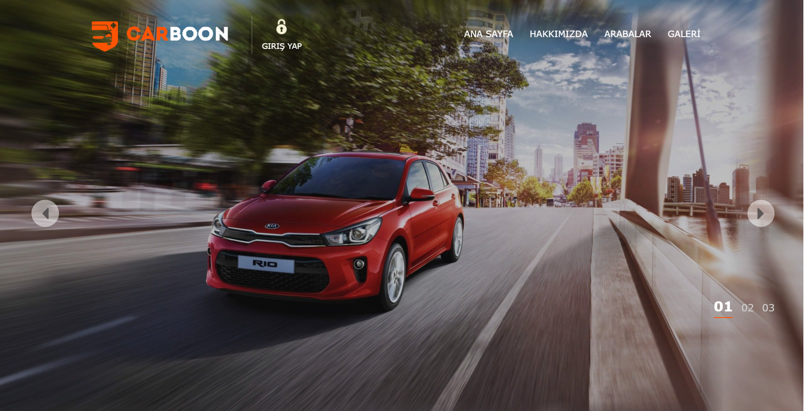

<h1 align="center">Carboon Rent a Car Website</h1>

&nbsp;&nbsp;&nbsp;&nbsp;&nbsp;&nbsp;&nbsp;&nbsp;&nbsp;&nbsp;&nbsp;&nbsp;&nbsp;&nbsp;&nbsp;&nbsp;&nbsp;&nbsp;&nbsp;&nbsp;&nbsp;&nbsp;&nbsp;&nbsp;&nbsp;&nbsp;&nbsp;&nbsp;&nbsp;&nbsp;&nbsp;&nbsp;&nbsp;&nbsp;&nbsp;&nbsp;&nbsp;&nbsp;&nbsp;&nbsp;&nbsp;&nbsp;&nbsp;&nbsp;&nbsp;&nbsp;&nbsp;&nbsp;&nbsp;&nbsp;&nbsp;&nbsp;&nbsp;&nbsp;&nbsp;&nbsp;&nbsp;&nbsp;&nbsp;&nbsp;&nbsp;&nbsp;&nbsp;&nbsp;&nbsp;&nbsp;&nbsp;&nbsp;&nbsp;&nbsp;

[](https://github.com/bertuginal/Carboon-Rent-a-Car/network/members)
[](https://github.com/bertuginal/Carboon-Rent-a-Car/stargazers)

---

This car rental site includes;
* You can see our special tools and user comments on the homepage.
* You can see information about the site in the About Us section and contact me.
* You can see the rental vehicles in the Vehicles section and when you hover over the vehicle, you can go to the rental vehicle page by clicking the "Rental" button below.
  * You can rent a vehicle of your choice by filling in your personal information, driver's license and contact information, car rental information in the car rental section, and by writing a description if you wish.
  * It is not possible to rent a car without being a member of the site, but you can visit the site without being a member.
* You can see who rented the vehicles and all our vehicles in the gallery section.

---

## :file_folder: Register Page
You can reach the " Carboon Rent a Car " website [here](https://carboon-414d8.web.app/welcome.html)!

## :warning: Technologies used

- [Firebase](https://firebase.google.com)
- [HTML](-)
- [CSS](-)
- [JavaScript](https://www.javascript.com)

## 🚀 Installation

Clone the repo, download this project and open the sln file.

```bash
git clone https://github.com/bertuginal/Carboon-Rent-a-Car
```

## :point_down: Images
<h4 align="center">Main Page</h4>

---

<div align="center"></div>
<h4 align="center">Rent A Car</h4>

---

<div align="center"></div>

---

## :clap: And it's done!
For questions or comments, you can contact me via this e-mail :email: bertuginal@yahoo.com

:star: If you like my project, can you click the star to support me?
